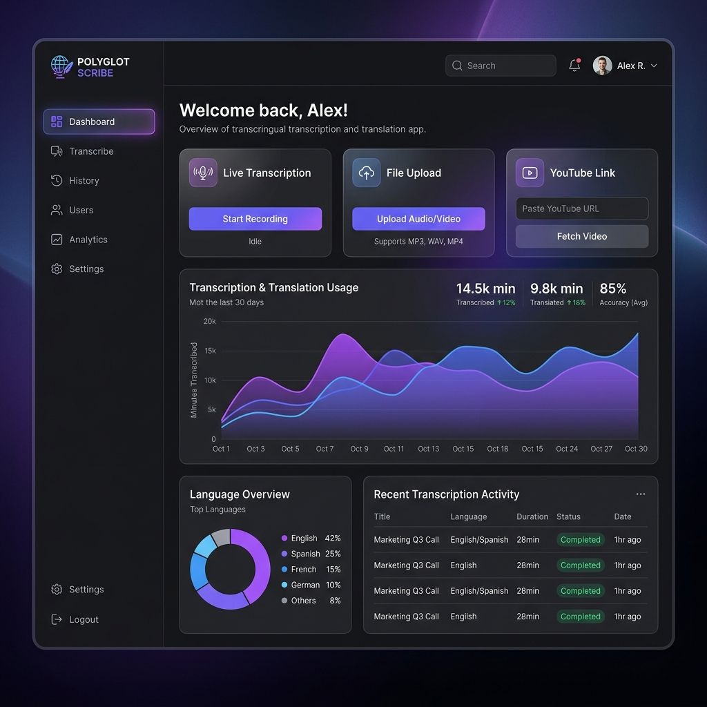
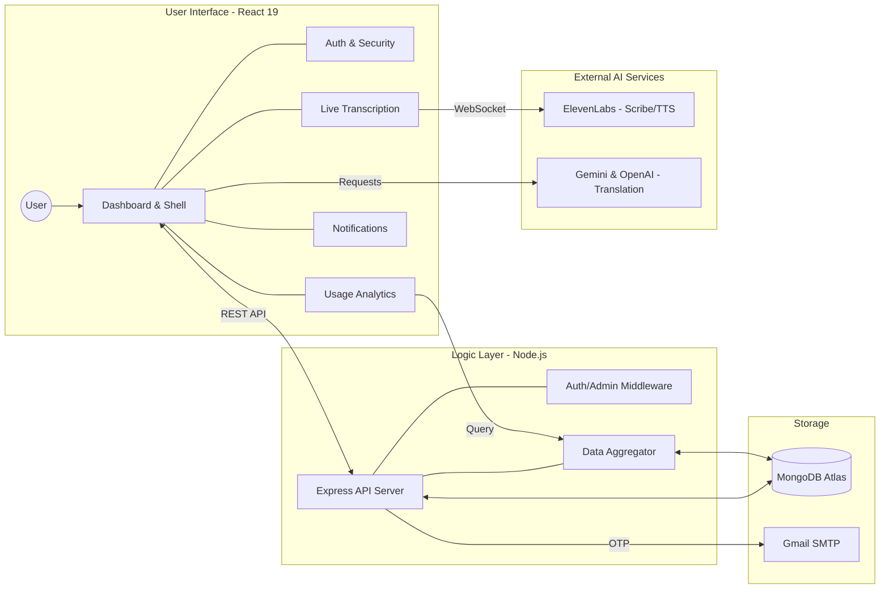

# 🎙️ Polyglot Scribe

**Polyglot Scribe** is a powerful, full-stack multilingual transcription and translation platform. It enables real-time speech-to-text, audio file transcription, and YouTube video processing with instant translation into multiple languages, including Amharic, Afaan Oromo, Somali, and English.



## 🚀 Features

### 🎙️ Advanced Transcription
- **Live Transcription**: Real-time speech-to-text directly from your microphone.
- **File Transcription**: Upload audio files (MP3, WAV, M4A) for fast processing.
- **YouTube Transcription**: Extract and transcribe audio from any YouTube URL.

### 🌍 Multilingual Translation
- Instant translation of transcripts into:
  - **Amharic** (አማርኛ)
  - **Afaan Oromo** (Oromiffa)
  - **Somali** (Soomaali)
  - **English**

### 🔐 Secure Authentication
- **Multi-factor Auth**: Secure sign-up/sign-in with OTP email verification.
- **Social Login**: Integrated Google OAuth support.
- **Session Management**: Secure JWT-based authentication.

### 🛠️ Admin Dashboard
- **User Management**: Monitor users, update credits, and manage roles.
- **System Control**: Manage hero images and core platform settings.
- **Analytics**: High-level overview of system usage.

---

## 🛠️ Tech Stack

### Frontend
- **Framework**: React 19 (Vite)
- **Routing & SSR**: TanStack Router & TanStack Start
- **State Management**: TanStack Query (React Query)
- **Styling**: Tailwind CSS 4 & Framer Motion
- **Data Visualization**: Recharts (Dynamic Analytics)
- **Icons**: Lucide React
- **Localization**: i18next & react-i18next (Amharic, Oromo, Somali, English)

### Backend
- **Runtime**: Node.js & Express 4
- **Database**: MongoDB Atlas with Mongoose 9
- **Security**: JWT (Access/Refresh Tokens), Helmet, Express Rate Limit
- **Auth**: Google OAuth 2.0 & Email OTP (Nodemailer)

### External APIs
- **Transcription**: ElevenLabs Scribe v2
- **Text-to-Speech**: ElevenLabs Multilingual TTS
- **Translation**: Google Gemini API (Option 1) or OpenAI GPT API (Option 2)

---

## 🚦 Getting Started

### Prerequisites
- **Node.js**: v18 or higher
- **Database**: A MongoDB Atlas connection string
- **Auth**: Google Cloud Console project for OAuth Client ID
- **Email**: Gmail account with "App Password" enabled for SMTP
- **AI Keys**: 
  - ElevenLabs API Key
  - Google Gemini API Key (Recommended) or OpenAI API Key

### Installation

1. **Clone the repository**
   ```bash
   git clone https://github.com/Muler8905/polyglotScribe.git
   cd polyglotScribe
   ```

2. **Setup Backend**
   ```bash
   cd backend
   npm install
   ```
   Create a `.env` file in the `backend` folder:
   ```env
   PORT=5000
   MONGODB_URI=your_mongodb_atlas_uri
   JWT_SECRET=your_long_random_jwt_secret
   JWT_REFRESH_SECRET=your_long_random_refresh_secret
   EMAIL_USER=your_gmail@gmail.com
   EMAIL_PASS=your_gmail_app_password
   FRONTEND_URL=http://localhost:8080
   ```

3. **Setup Frontend**
   ```bash
   cd frontend
   npm install
   ```
   Create a `.env` file in the `frontend` folder:
   ```env
   # Google OAuth
   VITE_GOOGLE_CLIENT_ID=your_google_client_id.apps.googleusercontent.com

   # Backend API
   VITE_API_URL=http://localhost:5000/api

   # AI Services (TanStack Start Server Side)
   ELEVENLABS_API_KEY=your_elevenlabs_key
   GOOGLE_GEMINI_API_KEY=your_gemini_key
   OPENAI_API_KEY=your_openai_key
   ```

### Running the App

1. **Start Backend Server**
   ```bash
   cd backend
   npm run dev
   ```

2. **Start Frontend Development Server**
   ```bash
   cd frontend
   npm run dev
   ```

3. Open your browser to `http://localhost:8080`

---

## 📊 System Architecture



---

## 📜 License

Distributed under the MIT License. See `LICENSE` for more information.

---

## 👤 Author

**Muler8905**
- GitHub: [@Muler8905](https://github.com/Muler8905)

---
*Developed for the multilingual community.*
